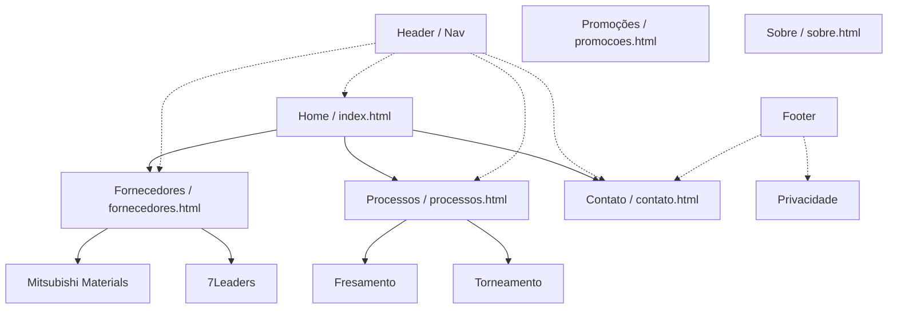

# RECOM® Site Architecture

Este documento descreve a hierarquia de páginas, o fluxo de navegação e a estrutura de componentes do projeto RECOM®.

## 1. Mapeamento de Componentes (DSCL)

Todos os componentes são regidos pelos contratos definidos em `src/design-system/components/component-contracts.js`.

| Componente | Tipo | Arquivo | Descrição |
| :--- | :--- | :--- | :--- |
| **Global Header** | Estrutural | `components/header.html` | Logo, Menu de Navegação e links rápidos. |
| **Global Footer** | Estrutural | `components/footer.html` | Informações regionais (Campinas/Região) e links úteis. |
| **Hero Section** | Layout | Dinâmico | Bloco de impacto com H1, Subtítulo e CTA. |
| **Supplier Card** | Interface | Dinâmico | Card de marca com logo, descrição e link para detalhes/catálogo. |
| **Process Card** | Interface | Dinâmico | Card de solução técnica por operação (Torneamento, etc). |

## 2. Estrutura do Design System (/src/design-system)

O projeto utiliza uma camada centralizada de ativos de design e lógica:

- **/tokens**: Definições fundamentais (Cores, Espaçamento, Tipografia, Radius).
- **/hooks**: Mapeamento de âncoras `data-hook` (`site-hooks.js`).
- **/components**: Contratos e variantes visuais de componentes.
- **/content**: Configurações de SEO, navegação e blocos editáveis.
- **/lib**: Lógica utilitária (Formulários, Analytics).
- **/docs**: Documentação técnica de engenharia.

---

## 3. Fluxo de Navegação

## 3. Diretrizes de Conteúdo

- **Páginas de Fornecedor:** Devem focar em autoridade de marca e disponibilidade de catálogo técnico.
- **Páginas de Processo:** Devem focar na aplicação prática no chão de fábrica.
- **Formulário de Contato:** Deve capturar dados específicos de usinagem (códigos de ferramentas, desenhos).
