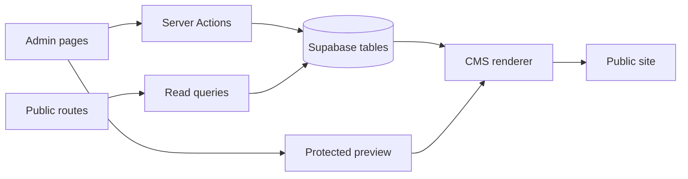

# RECOM CMS Fase 1 Design Spec

Date: 2026-04-26

## Summary

Build a block-based CMS layer on top of the current RECOM app without rewriting the site. The first release must create a real page/section model backed by Supabase, a safe component registry, a protected admin editor, and a public renderer that only shows published data.

This phase must use the existing Next.js app, current Supabase integration, and the current admin shell. It must not introduce freeform code execution, arbitrary HTML, arbitrary classes, or mock data as the main content source.

## Current State

The repository already has:

- a working Next.js app router structure;
- an existing admin shell under `src/app/(admin)/admin`;
- public pages that currently render fixed layouts;
- Supabase client helpers in `src/lib/supabase`;
- server actions for suppliers, processes, promotions, and leads;
- existing RLS tables for core commerce data;
- a mock auth path that is still used by the current login flow.

The CMS phase must build on that base instead of replacing it.

## Phase 1 Goals

The first CMS release must allow:

- creating pages in the database;
- creating, editing, duplicating, hiding, archiving, and reordering sections;
- editing block props through controlled fields;
- publishing a page and creating a version snapshot;
- previewing draft content in a protected admin route;
- rendering published content on the public site from Supabase;
- rejecting invalid block types or invalid props without breaking the whole page;
- removing mock data as the primary source for CMS content;
- keeping the current admin and legacy public routes working during the rollout.

## Out of Scope For Phase 1

Do not build these yet:

- theme editor;
- asset library and uploads;
- navigation editor;
- global settings editor;
- advanced drag and drop;
- multi-tenant support;
- granular RBAC beyond the minimal authenticated gate;
- arbitrary HTML, JSX, JS, or Tailwind class editing;
- a Webflow-style freeform page builder;
- rewrite of the legacy supplier/process/promotion public pages.

## Architecture Overview



The CMS layer is page first:

- a page owns a list of sections;
- each section stores a `component_type`, `sort_order`, lifecycle status, visibility, and JSON props;
- the renderer only knows how to render registered components;
- the admin only edits the props allowed by the component registry.

## Data Model

Create a new migration for the CMS tables. Do not alter the older commerce migrations destructively.

### pages

Minimum fields:

- `id` uuid primary key;
- `slug` text unique not null;
- `title` text not null;
- `description` text nullable;
- `status` text not null default `draft`;
- `seo_title` text nullable;
- `seo_description` text nullable;
- `og_image_url` text nullable;
- `published_at` timestamptz nullable;
- `created_by` uuid nullable;
- `updated_by` uuid nullable;
- `created_at` timestamptz not null default `now()`;
- `updated_at` timestamptz not null default `now()`.

### page_sections

Minimum fields:

- `id` uuid primary key;
- `page_id` uuid foreign key to `pages(id)` on delete cascade;
- `component_type` text not null;
- `props` jsonb not null default `{}`;
- `sort_order` int not null default `0`;
- `status` text not null default `draft`;
- `visibility` text not null default `visible`;
- `anchor_id` text nullable;
- `created_by` uuid nullable;
- `updated_by` uuid nullable;
- `created_at` timestamptz not null default `now()`;
- `updated_at` timestamptz not null default `now()`.

Status semantics:

- page status values: `draft`, `published`, `archived`;
- section lifecycle values: `draft`, `published`, `archived`;
- section visibility values: `visible`, `hidden`.

The UI can show "hidden" as a user action, but persisted rendering must use `visibility = hidden` so that a published section can remain hidden without changing its lifecycle history.

### page_versions

Minimum fields:

- `id` uuid primary key;
- `page_id` uuid foreign key to `pages(id)` on delete cascade;
- `version_number` int not null;
- `snapshot` jsonb not null;
- `created_by` uuid nullable;
- `created_at` timestamptz not null default `now()`.

Add a unique constraint for `(page_id, version_number)`.

### Deferred tables

Do not implement these in phase 1 unless there is already a partial base that is clearly reusable:

- `site_theme`;
- `assets`;
- `navigation_items`;
- `site_settings`.

## Reserved Slugs

Phase 1 must reserve slugs that already belong to legacy routes or framework routes.

Reserved examples:

- `home` for the root public page;
- `admin`;
- `login`;
- `fornecedores`;
- `processos`;
- `promocoes`;
- `sobre`.

The CMS slug validator must reject those reserved values for new generic pages, except for the internal `home` record used by `/`.

## Component Registry

Create a central registry at `src/cms/component-registry.ts`.

The registry is the only allowed source of renderable CMS blocks.

Definition shape:

```ts
type EditableComponentDefinition = {
  type: string;
  label: string;
  description: string;
  category: "layout" | "content" | "commerce" | "trust" | "navigation" | "media" | "cta";
  component: React.ComponentType<any>;
  schema: ZodSchema;
  defaultProps: Record<string, unknown>;
  fields: EditorField[];
  allowedSlots?: string[];
  allowedVariants?: string[];
  allowedThemeControls?: string[];
};
```

The `fields` metadata powers the admin form builder. The field system only needs a small set in phase 1:

- `text`;
- `textarea`;
- `select`;
- `switch`;
- `url`;
- `markdown` or `richtext` limited to safe text-only formatting;
- `relation` only if a block needs to point at existing records.

The block schemas must be strict. Unknown keys in props should fail validation for publish and preview.

### Phase 1 registered blocks

Start with these approved blocks only:

- `HeroSection`;
- `PageHeader`;
- `CTASection`;
- `SupplierGrid`;
- `ProcessGrid`;
- `PromotionGrid`;
- `TextSection`.

### Minimal block props

#### HeroSection

- `eyebrow`;
- `title`;
- `subtitle`;
- `primaryCtaLabel`;
- `primaryCtaHref`;
- `secondaryCtaLabel`;
- `secondaryCtaHref`;
- `imageUrl` optional;
- `variant`.

#### PageHeader

- `eyebrow`;
- `title`;
- `subtitle`.

#### CTASection

- `eyebrow` optional;
- `title`;
- `text`;
- `primaryCtaLabel`;
- `primaryCtaHref`;
- `secondaryCtaLabel` optional;
- `secondaryCtaHref` optional;
- `note` optional;
- `variant`.

#### SupplierGrid

- `title`;
- `description`;
- `mode` with values `automatic` or `manual`;
- `supplierIds` array;
- `limit`;
- `showCatalogLinks`.

#### ProcessGrid

- `title`;
- `description`;
- `mode` with values `automatic` or `manual`;
- `processIds` array;
- `limit`.

#### PromotionGrid

- `title`;
- `description`;
- `mode` with values `automatic` or `manual`;
- `promotionIds` array;
- `limit`.

#### TextSection

- `title`;
- `body`;
- `variant`.

Text content must stay controlled. No raw HTML. Markdown support, if used, must be limited to a safe subset.

## Data Flow

### Public rendering

1. route requests a page by slug;
2. query loads the page record;
3. query loads sections for that page;
4. query filters to published and visible rows;
5. renderer looks up every section in the registry;
6. section props are validated with the block schema;
7. valid sections render;
8. invalid sections are skipped on public routes and logged server side.

### Preview rendering

1. authenticated admin opens `/admin/preview/[slug]`;
2. preview query loads draft and published sections for the page;
3. renderer still validates through the registry;
4. invalid sections display a visible diagnostic card in preview/admin instead of silently disappearing;
5. preview does not expose content to anonymous users.

### Admin editing

1. admin opens `/admin/pages`;
2. list query reads real pages from Supabase;
3. admin creates or edits a page;
4. admin adds sections from the registry;
5. form fields are generated from the block definition;
6. actions persist draft changes to Supabase;
7. publish validates the whole page tree before changing the published state.

## Renderer Rules

Create:

- `src/cms/render-page.tsx`;
- `src/cms/render-section.tsx`.

The renderer must:

- refuse unknown `component_type` values;
- validate section props before rendering;
- isolate one bad section so the whole page does not fail;
- render fallback error UI only in preview/admin;
- return `null` for invalid sections on the public site;
- support manual rendering of entity-backed blocks such as suppliers, processes, and promotions by reading the existing tables.

### Entity-backed blocks

These blocks must reference the existing commerce tables instead of duplicating their content:

- `SupplierGrid`;
- `ProcessGrid`;
- `PromotionGrid`.

Each one must support:

- `automatic` mode: query active records from the existing table;
- `manual` mode: use the ids provided in `props` and preserve the order supplied by the admin.

## Queries

Create `src/server/queries/cms-pages.ts` for read-only data access.

The query layer should expose helpers such as:

- `listPages`;
- `getPageById`;
- `getPageBySlug`;
- `getPreviewPageBySlug`;
- `getPageVersions`;
- `getSectionsForPage`.

Rules:

- public queries return only published and visible CMS content;
- preview/admin queries can return draft content but only for authenticated users;
- queries must never fall back to mock CMS data.

The existing fallback arrays in `src/lib/services/supabase-data.ts` can stay for the legacy supplier/process/promotion pages during the migration, but they must not be used as the CMS source of truth.

## Server Actions

Create `src/server/actions/cms-pages.ts`.

Phase 1 actions:

- `createPage`;
- `updatePage`;
- `archivePage`;
- `createSection`;
- `updateSection`;
- `duplicateSection`;
- `reorderSections`;
- `hideSection`;
- `archiveSection`;
- `publishPage`;
- `restorePageVersion`.

Action contract:

```ts
type ActionResult<T = unknown> =
  | { ok: true; data?: T; message?: string }
  | { ok: false; fieldErrors?: Record<string, string[]>; formError?: string };
```

Action requirements:

- verify authentication on the server;
- validate input with Zod;
- normalize slugs and text fields;
- save to Supabase;
- handle errors without throwing expected failures into the UI;
- revalidate affected routes;
- never expose service-role credentials to the client.

### Atomic operations

Actions that touch multiple rows, especially `publishPage`, `restorePageVersion`, and `reorderSections`, should be implemented atomically whenever possible. If the implementation needs a small SQL helper or RPC to keep the database consistent, that helper belongs in the migration layer and must be called from the server action.

### Publish flow

When publishing a page:

1. validate the page and all sections;
2. create a version snapshot;
3. mark the page as `published`;
4. mark non-archived sections as `published` while preserving hidden state;
5. update `published_at`;
6. revalidate public and admin paths;
7. return a structured success result.

If any validation step fails, the page must remain unpublished.

### Restore flow

Restoring a version should:

1. load the snapshot;
2. recreate or update the draft page and draft sections;
3. keep the restored content in draft state;
4. require an explicit publish step afterward.

## Authentication and Security

Phase 1 must remove the mock auth path as the primary admin flow.

Current mock auth helpers in:

- `src/server/actions/auth.ts`;
- `src/lib/auth/utils.ts`;
- `src/lib/supabase/middleware.ts`;

should be replaced or downgraded so that admin access depends on a real Supabase session.

Security rules:

- all `/admin` and `/admin/preview/*` routes require a real session;
- all CMS mutations require server-side auth validation;
- service role keys stay server only;
- public routes can only read published CMS content;
- draft content stays private to authenticated preview/admin routes;
- no client component should be able to bypass the server action gate.

RBAC note:

- if a roles table or profile role already exists, honor it;
- if it does not exist, phase 1 can use the authenticated-user gate only;
- the code should keep the role check isolated so a future `owner/admin/editor/viewer` model can be added without rewriting every action.

## RLS Policy Intent

Apply RLS to the new CMS tables.

Intended policies:

- `pages`: public select only when `status = 'published'`; authenticated select all; authenticated insert/update only;
- `page_sections`: public select only when the section belongs to a published page and `visibility = 'visible'`; authenticated select all; authenticated insert/update only;
- `page_versions`: authenticated only;
- inserts and updates must still be validated in server actions before reaching the database.

The implementation can use direct table policies or a small read-only view if that is simpler, but public access must never include draft content.

## Admin UX

Use the existing shadcn/ui stack and the current visual language.

### `/admin/pages`

Show:

- title;
- slug;
- status badge;
- updated_at;
- published_at;
- actions for edit, preview, and archive.

Empty state should invite the user to create the first page.

### `/admin/pages/new`

Should let the user create a page with:

- title;
- slug;
- description;
- SEO title;
- SEO description;
- OG image URL.

### `/admin/pages/[id]`

Should provide:

- page metadata editing;
- save draft;
- publish;
- archive;
- version list or access to version history;
- current status and last updated metadata.

### `/admin/pages/[id]/sections`

Should provide:

- section list sorted by `sort_order`;
- add section from registry;
- duplicate section;
- hide section;
- archive section;
- move section up/down;
- edit props through generated fields;
- save draft;
- preview.

No advanced drag and drop in phase 1. Up/down controls are enough.

### UI states

Every admin screen must include:

- loading state;
- empty state;
- error state;
- success feedback;
- disabled actions during submit;
- confirmation before destructive actions;
- clear status labels.

## Public Routes

Phase 1 must add CMS rendering without breaking the current site.

Route strategy:

- `/` should first try to render the CMS page with slug `home`;
- if that record does not exist or is not published yet, keep the current legacy home page as a temporary fallback;
- `/(public)/[slug]` can render other CMS pages that do not collide with existing legacy routes;
- legacy fixed routes such as `/fornecedores`, `/processos`, `/promocoes`, and `/sobre` remain in place for phase 1.

That fallback is temporary and is not the primary content source once the CMS page exists.

## Validation

Create Zod schemas for:

- page create/update;
- section create/update;
- publish input;
- version restore input;
- every block prop schema.

Validation rules:

- slugs must be kebab-case and not empty;
- reserved slugs must be rejected;
- block props must match the registry schema;
- unknown keys should fail for publish and preview;
- `TextSection.body` must be limited to controlled text or safe markdown;
- publish must fail if any visible section is invalid.

## Revalidation

After CMS mutations, revalidate the affected routes.

At minimum:

- the public page path;
- `/admin/pages`;
- `/admin/pages/[id]`;
- `/admin/preview/[slug]`;
- any additional public path created by the CMS page.

## Rollout Plan

1. add the CMS migration and regenerate Supabase types;
2. add the CMS query layer;
3. add the registry and block schemas;
4. add the renderer;
5. add the admin pages and server actions;
6. replace mock auth as the primary admin flow;
7. wire the public root page to CMS `home`;
8. validate with lint, typecheck, and build;
9. only then consider the next phase.

## Acceptance Criteria For Phase 1

Phase 1 is acceptable only when all of the following are true:

- `/admin/pages` lists real pages from Supabase;
- admin can create a page;
- admin can add a section from the registry;
- admin can edit section props;
- admin can reorder sections;
- admin can duplicate a section;
- admin can hide and archive a section;
- admin can save draft changes;
- admin can preview draft content in a protected route;
- admin can publish a page;
- publishing creates a version snapshot;
- the public site renders published CMS content from the database;
- an invalid CMS section does not break the whole public page;
- mock data is not the primary CMS source;
- the admin path is not protected by mock auth as the main gate;
- Zod validation runs server side for all mutations;
- `npm run lint`, `npm run typecheck`, and `npm run build` pass.

## Risks And Mitigations

- Risk: auth is not fully configured in the environment.
  - Mitigation: fail closed, keep admin inaccessible until a real session exists, and make the login page real rather than mock.
- Risk: reserved route collisions.
  - Mitigation: reject reserved CMS slugs and keep legacy routes intact for phase 1.
- Risk: invalid section props breaking the page.
  - Mitigation: strict schemas, per-section error isolation, and null rendering for public routes.
- Risk: publish becoming partially applied.
  - Mitigation: keep publish and restore atomic or use a small DB helper for the multi-row update.
- Risk: scope creep into theme/assets/navigation/settings.
  - Mitigation: defer those systems to later phases even if the registry makes room for them.

## Files Expected In Phase 1

Likely new files:

- `src/cms/component-registry.ts`;
- `src/cms/render-page.tsx`;
- `src/cms/render-section.tsx`;
- `src/cms/schemas/page.schema.ts`;
- `src/cms/schemas/section.schema.ts`;
- `src/cms/schemas/components/*.ts`;
- `src/server/actions/cms-pages.ts`;
- `src/server/queries/cms-pages.ts`;
- `src/lib/revalidation/cms.ts` or an extension of the existing revalidation helper;
- `src/app/(admin)/admin/pages/page.tsx`;
- `src/app/(admin)/admin/pages/new/page.tsx`;
- `src/app/(admin)/admin/pages/[id]/page.tsx`;
- `src/app/(admin)/admin/pages/[id]/sections/page.tsx`;
- `src/app/(admin)/admin/preview/[slug]/page.tsx`;
- `src/app/(public)/[slug]/page.tsx` or the equivalent public CMS route;
- CMS migration file under `supabase/migrations`.

Likely changed files:

- `src/app/(public)/page.tsx`;
- `src/app/(admin)/admin/layout.tsx`;
- `src/server/actions/auth.ts`;
- `src/lib/auth/utils.ts`;
- `src/lib/supabase/middleware.ts`;
- `src/lib/database.types.ts` after regeneration.

## Final Note

This phase is intentionally narrow. The result should be powerful enough to manage real pages and sections, but controlled enough that a normal editor cannot break the site or run arbitrary code.
